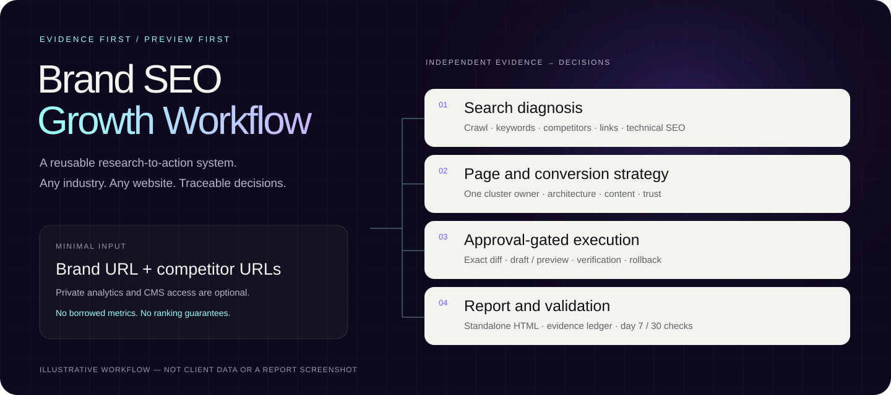

# Aident SEO Growth Agency

[English](README.md) · [Agent 指令](SKILL.md) · [工具能力与替补](references/search-and-crawl-fallbacks.md) · [维护与校验](CONTRIBUTING.md) · [授权说明](NOTICE.md)



**输入品牌官网／品牌信息和竞品网址，产出有来源、可执行、可验证的 SEO 增长方案。**

这不是只生成文章的提示词，也不是一键自动排名工具。它是一套可复用的 Agent Skill：组织独立调研、技术检查、关键词机会、竞品差距、网站架构、页面草稿、审批式实施和效果验证。需要可视化交付时，生成专业报告页面形式的独立 HTML，内置中英文字体、颜色和交互，不依赖其他 PPT／设计 Skill。

支持 Shopify、WordPress、Webflow、自建／Headless 网站，以及**没有 CMS 或私有数据连接、只有公开网址**的分析。适配电商、SaaS、B2B、本地服务、内容站和受监管行业；不会把电商分类页模板强加给所有业务。

## 快速开始

### 安装完整 Skill

```bash
npx skills add https://github.com/Edward-J-create/aident-seo-growth-agency --skill aident-seo-growth-agency
```

也可以克隆后放入 Agent 的技能目录。以下为 Codex 的首次安装示例；如果目标已存在，先备份、比较，不要覆盖未保存的本地改动：

```bash
git clone https://github.com/Edward-J-create/aident-seo-growth-agency.git
mkdir -p ~/.codex/skills
cp -R aident-seo-growth-agency ~/.codex/skills/aident-seo-growth-agency
```

Claude Code 可将完整目录放到 `~/.claude/skills/aident-seo-growth-agency`。其他 Agent 使用其约定的 Skill 目录和调用方式。**不要只复制 `SKILL.md`**：参考文档、CSV/YAML 模板、字体和脚本都属于能力包。安装 Skill 不会自动授权任何外部账号。

### 给 Agent 一段任务

```text
使用 $aident-seo-growth-agency 分析我的网站。
品牌官网：https://example.com
品牌信息：我们为中小企业提供项目管理软件。
目标市场：美国／英语。
参考竞品：https://competitor.example

请独立搜索相关竞品并采集证据，分析技术 SEO、关键词、内容缺口、
网站架构、转化路径与外链，给出 P0/P1/P2 路线图和 3 个优先页面草稿。
输出详细、清晰、专业的单文件 HTML 报告和关键词／页面清单。
此次仅做分析与建议；不修改、发布网站，不自动联系第三方。
缺少 GSC 等私有数据时完成公开网址分析，明确未测量项。
```

`example.com` 和 `.example` 域名仅作格式示例，请替换成真实目标。更多行业与实施模式示例见 [examples/prompts.md](examples/prompts.md)。

## 输入与权限

| 输入／连接 | 用途 | 是否必需 |
| --- | --- | --- |
| 品牌官网或品牌信息 | 确定业务、页面和增长目标 | 基础输入；没有网址时仅做信息与策略层分析 |
| 竞品网址或信息 | 直接竞品对比 | 可提供；缺少时独立发现并说明选择理由 |
| 国家／语言／核心转化 | 决定数据库、搜索意图和页面类型 | 可从明确业务信息推断；歧义重大时确认 |
| Firecrawl／Exa／TinyFish 等 | 公开网页发现和内容提取 | 需要可用的信息采集途径，不要求每个服务都连接 |
| Ahrefs | 搜索量、KD、Parent Topic、流量及外链估算 | 数据增强；缺失时不伪造这些指标 |
| GSC、分析系统、CRM | 真实点击、展现、转化、线索质量 | 可选，且仅使用获授权的目标属性 |
| CMS | 读取配置、生成草稿或执行变更 | 可选；没有时交付平台无关的字段 diff 与开发验收项 |

第三方报告只能启发研究范围或展示方式，不能直接充当数据来源。品牌原站的营销自述也不自动等于已验证的效果、资格或合规事实。

## 工作流：从证据到执行

| 阶段 | 核心工作 | 输出 |
| --- | --- | --- |
| 1. 业务与来源 | 行业、受众、地域、语言、转化目标、能力覆盖 | 项目 brief、来源台账、限制说明 |
| 2. 抓取与盘点 | Sitemap、导航、URL、模板、内容、公开索引边界 | 页面清单、已观察／未覆盖的范围 |
| 3. 搜索机会 | 竞品、关键词、Parent Topic、意图、SERP、商业价值 | 关键词机会表与 Content Gap |
| 4. 技术诊断 | 状态码、索引、canonical、重复内容、内链、Schema、性能 | 有 URL 证据、负责人、验收条件的修复清单 |
| 5. 架构与内容 | 唯一关键词簇归属、导航、页面层级、内链、内容草稿 | 页面 map、P0/P1/P2、默认 3 个页面草稿 |
| 6. 转化与可信度 | 角色／语言路径、CTA、声明证据、外链语境 | 现有能力保留项、优化建议与测量设计 |
| 7. 审批式实施 | 目标账号、字段前后对照、草稿状态、风险、回滚 | 待审批变更包；获批后才执行对应批次 |
| 8. 交付与验证 | 证据复核、独立 HTML、7／30 天检查 | 完整报告、操作记录、验证计划 |

完整规则以 [SKILL.md](SKILL.md) 及其按需引用的文档为准，不要求简单任务走完所有模块。

## Aident Loadout：具体工具与边界

外部集成优先通过 [Aident Loadout](https://loadout.aident.ai) 发现和管理。CLI 可用时先读 `aident --help`；仅有 MCP 时使用对应的发现、Vault 和执行能力。每次运行依次检查**能力 → 实时 schema → 连接 → 精确输入预检 → 执行 → 返回数据 → 审计费用**。不把注册表里的历史名称当成永远可用的 API。

| 工具 | 任务／能力 | 不应混淆的边界 |
| --- | --- | --- |
| Firecrawl | Search、Map、Scrape、Crawl；站点结构和代表页面提取 | 抓取上限不等于全站覆盖 |
| Exa | `exa_search`、`exa_get_contents_action`；发现竞品、提取已知 URL | 搜索相关性分数不是 Google 排名 |
| TinyFish | `search`、`fetch_urls`；必要时受限只读 `run` | Browser Agent 有写能力，不能借机提交表单、登录或绕过限制 |
| Ahrefs MCP | Organic Competitors、Organic Keywords、Top Pages、Matching／Related Terms、SERP、Backlinks | 公开数据是估算；域名分析使用 `mode=subdomains` |
| GSC | Search Analytics、URL Inspection、Sitemaps | 是已授权网站的一方数据，不提供竞品私有数据、收入或 KD |
| Ahrefs Site Audit | Projects、Issues、Page Explorer／Content | 必须有目标项目权限；历史快照不是刚刚完成的抓取 |
| Brand Radar | 品牌提及、引用域名／页面、回答样本、SOV | 样本可见性不等于所有 AI 平台；无权限不是零引用 |
| GTmetrix／可用性能来源 | 测试、报告、资源；区分 field／lab | 创建测试可能计费；不自动创建持续监控 |
| Shopify／其他 CMS | 读取、草稿和获批字段变更 | 注册了工具不等于已连接；连接也不等于允许发布 |
| TikHub（按需） | 小红书／微信公开搜索与内容研究 | 只在渠道范围适用时使用；互动量不能当 SEO 搜索量 |

完整标识符和操作规则：[核心工具注册表](references/aident-loadout-tools.md)、[Exa／TinyFish／GSC 路由](references/search-and-crawl-fallbacks.md)、[扩展能力](references/extended-tool-coverage.md)。其中的验证日期是能力发现的历史记录，**不是你当前账号已连接或刚刚执行的证明**。

不要求安装每一家服务。若某项不可用，选择适合该证据类型的替补，记录缺口；不能用通用搜索结果补造搜索量、KD 或真实转化率。第三方服务可能收费，预检估算未必是最终费用上限；遇到账单或风险确认必须按运行时规则停止并确认。

## 标准交付包

- 执行摘要、业务 brief、假设、来源与工具使用台账。
- 当前网站与技术问题清单；竞品角色、关键词／内容／外链差距。
- 有来源的关键词机会表；目标 200–500 个，但只在数据与相关性支持时达到，不凑数。
- 导航、URL、页面层级、簇归属、内链和 P0/P1/P2 上线顺序。
- 默认 3 个优先页面草稿：Title、Meta、H1–H3、正文／大纲、FAQ、CTA、Alt、内链和适用 Schema。
- 待审批变更计划；实际执行才提供操作日志和真实预览链接。
- 基线及第 7／30 天验证计划，必要时延伸至 60／90 天。
- 用户要求时：保留完整分析颗粒度的单文件 HTML，不用一页摘要替代详细报告。

“未测量”“未连接”“待审批”必须明确显示；不承诺收录、排名、流量、营收或 AI 引用。

## 内置 HTML 报告能力

报告是**响应式网页文档，不是固定比例 PPT**。采用深紫、纸白、细分割线和克制的青／紫／粉色点缀，支持高层快速阅读与操作人员查证。

- 自带配色 token 和原生 CSS 几何装饰，不需要外部设计 Skill、CDN、框架或品牌素材服务。
- 内置 Outfit（英文标题／数字）、Smiley Sans（中文展示标题）、Noto Sans SC（中英正文／表格），保留各自 OFL 授权。
- 原生 tab 按钮、键盘切换、焦点状态、hash 深链接、打印全章节和无 JavaScript 阅读回退。
- 复杂报告按“业务决策／搜索诊断／页面与转化／信任与权威／执行与证据”分组，避免模糊口号式标题。
- 构建后字体和获准本地图片内嵌，引用链接仍可点击。离线阅读不意味着离线开展新 SEO 调研。

本地生成**结构示例**（不是已完成的 SEO 分析）：

```bash
python3 scripts/build_standalone_report.py assets/html-report-template.html --output output/report-template.html
python3 scripts/validate_html_report.py output/report-template.html
```

打开 `output/report-template.html` 查看。Agent 交付前必须替换模板指引、示例内容和未测量字段，完整填入独立证据。中文全字库内嵌后文件约 24 MiB 起，便携但并不轻量。静态检查通过不代表已经进行浏览器视觉、无障碍或真实数据复核。

## 本地脚本与运行要求

脚本只使用 Python 标准库，建议 Python 3.10+。Node.js 20+ 用于 HTML 内联 JavaScript 语法检查和交互逻辑测试；不需要 npm 包或框架。SEO 调研由 Agent 调用已连接的工具完成，脚本不会自动获取数据或发布网站。

```bash
python3 scripts/normalize_keywords.py assets/keyword-input-template.csv output/keywords.csv
python3 scripts/validate_page_map.py assets/page-map-template.csv
python3 scripts/validate_package.py
python3 -m unittest discover -s tests -v
node tests/test_tabs.mjs
```

CSV 示例均为合成演示数据。关键词分数是透明的启发式排序，不是预测模型；缺失权重会标为 partial。不同来源或日期的冲突应先人工核对，原始导出不可被归一化结果取代。页面校验器辅助发现归属冲突，不能自动替代 SERP 与搜索意图判断。

## 仓库结构

```text
aident-seo-growth-agency/
  SKILL.md                        Agent 工作流入口
  README.md / README.zh.md        英文首页与完整中文文档
  NOTICE.md / SECURITY.md         权利、数据与披露边界
  CONTRIBUTING.md                 维护、测试与发布检查
  agents/openai.yaml              Codex UI 与工具元数据
  references/                    13 份按任务加载的研究／实施规则
  assets/                        HTML、brief、CSV 模板
    fonts/                       3 套字体及各自许可证
    previews/workflow.svg        原创流程说明图，非客户报告截图
  examples/                      合成 brief 和多行业调用示例
  scripts/                       归一化、页面／HTML／包校验、独立构建
  tests/                         无网络回归测试
  .github/workflows/validate.yml  推送与 PR 自动校验
```

## 安全与权利

只读诊断不授权修改生产站。即使工具连接成功，CMS 变更仍需明确目标、字段、状态、风险和回滚，并获得相应批次确认。检查公网内容不授权访问私人表单记录、医疗信息或客户数据。

此仓库不包含真实客户报告、采集响应、凭证、账号标识或私人原始数据。公开展示不自动赋予整个仓库开源许可；字体各自遵循 OFL，详见 [NOTICE.md](NOTICE.md)。没有复制参考 PPT 仓库的 logo、背景、图标或幻灯片素材。
